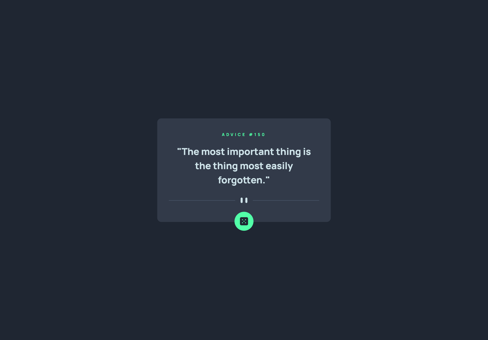

# Frontend Mentor - Advice generator app solution

This is a solution to the [Advice generator app challenge on Frontend Mentor](https://www.frontendmentor.io/challenges/advice-generator-app-QdUG-13db). Frontend Mentor challenges help you improve your coding skills by building realistic projects.

## Table of contents

- [Overview](#overview)
  - [Screenshot](#screenshot)
  - [Links](#links)
- [My process](#my-process)
  - [Built with](#built-with)
- [Author](#author)

## Overview

### Screenshot

### Links

- [Solution URL](https://github.com/saakarx/advice-generator-app)
- [Live Site URL](https://advice-generator-saakar.vercel.app/)

## My process

### Built with

- Semantic HTML5 markup
- CSS custom properties
- Flexbox
- CSS Grid
- [TailwindCSS](https://tailwindcss.com/)

## Author

- Frontend Mentor - [@saakarx](https://www.frontendmentor.io/profile/saakarx)
- Twitter - [@SaakarX](https://www.twitter.com/SaakarX)
